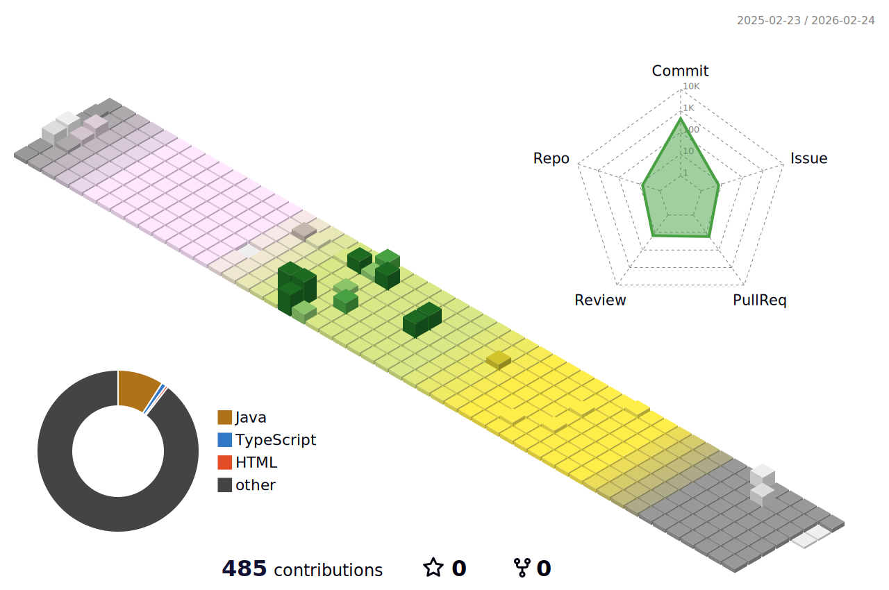

# Hi there 👋

<!--
**chews26/chews26** is a ✨ _special_ ✨ repository because its `README.md` (this file) appears on your GitHub profile.

Here are some ideas to get you started:

- 🔭 I’m currently working on ...
- 🌱 I’m currently learning ...
- 👯 I’m looking to collaborate on ...
- 🤔 I’m looking for help with ...
- 💬 Ask me about ...
- 📫 How to reach me: ...
- 😄 Pronouns: ...
- ⚡ Fun fact: ...
-->

# Blog posts
<!-- BLOG-POST-LIST:START -->
- [2024 스파르타 내일배움캠프 Sping 트랙 참여 // day33](https://shinelee26.tistory.com/42)
- [2024 스파르타 내일배움캠프 Sping 트랙 참여 // day32](https://shinelee26.tistory.com/41)
- [2024 스파르타 내일배움캠프 Sping 트랙 참여 // day31](https://shinelee26.tistory.com/40)
- [2024 스파르타 내일배움캠프 Sping 트랙 참여 // day30](https://shinelee26.tistory.com/39)
<!-- BLOG-POST-LIST:END -->
