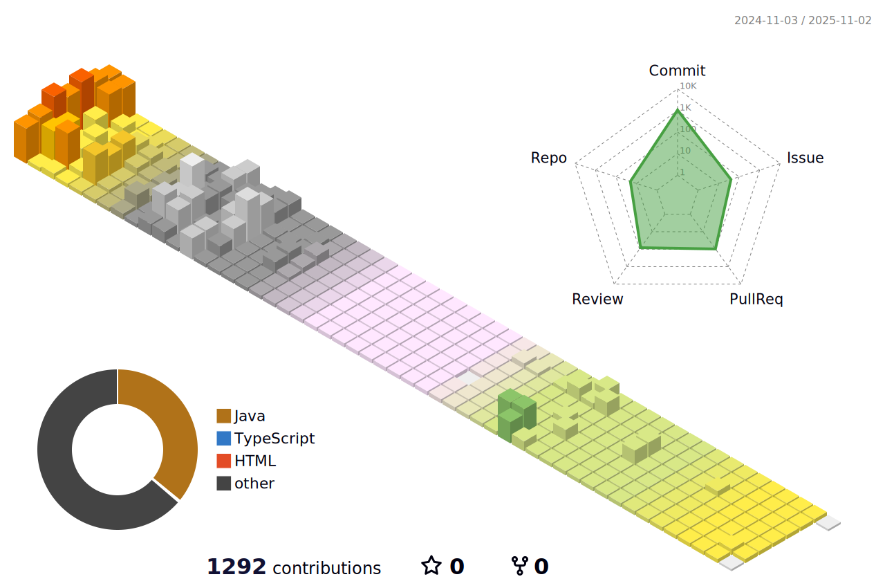

# Hi there 👋

<!--
**chews26/chews26** is a ✨ _special_ ✨ repository because its `README.md` (this file) appears on your GitHub profile.

Here are some ideas to get you started:

- 🔭 I’m currently working on ...
- 🌱 I’m currently learning ...
- 👯 I’m looking to collaborate on ...
- 🤔 I’m looking for help with ...
- 💬 Ask me about ...
- 📫 How to reach me: ...
- 😄 Pronouns: ...
- ⚡ Fun fact: ...
-->

# Blog posts
<!-- BLOG-POST-LIST:START -->
- [250121 TIL / Java, Spring, 기타 CS 지식 정리](https://shinelee26.tistory.com/68)
- [250120 TIL / Tripf 프로젝트 중간 점검, Tripf 트러블슈팅](https://shinelee26.tistory.com/67)
- [250107 TIL / Tripf 프로젝트 2~4일차 회의](https://shinelee26.tistory.com/66)
- [250102 TIL / Tripf 프로젝트 1일차 회의, PostgreSQL GIS](https://shinelee26.tistory.com/65)
<!-- BLOG-POST-LIST:END -->
